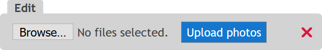
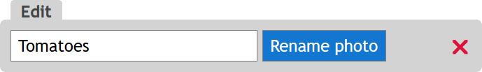

# ASP.NET Core Photo Gallery 

A photo gallery site implemented in ASP.NET Core 2.0 Razor Pages.

**Demo website**: <https://gallerytemplate.azurewebsites.net/>

## Features

- Elegant masonry layout of images
- High performance. Gets 100/100 points on Google PageSpeed Insights 
  - [Run PageSpeed Insights](https://developers.google.com/speed/pagespeed/insights/?url=https%3A%2F%2Fgallerytemplate.azurewebsites.net%2F)
- Speed Index < 1000
  - [See WebPageTest](http://www.webpagetest.org/result/170830_XB_c81df8181632a2db8433862f8584ccd8/) 
- Meets highest accessibility standards 
  - [Run accessibility validator](http://wave.webaim.org/report#/https://gallerytemplate.azurewebsites.net)
- W3C standards compliant HTML and CSS 
  - [Run HTML validator](https://html5.validator.nu/?doc=https%3A%2F%2Fgallerytemplate.azurewebsites.net)
- Automatic thumbnail generation
- Responsive web design
  - [See mobile emulators](https://www.responsinator.com/?url=https%3A%2F%2Fgallerytemplate.azurewebsites.net%2Falbum%2Fwinter%2F)
- Mobile friendly
  - [Run Mobile-Friendly Test](https://search.google.com/test/mobile-friendly?id=a6_0iisWRO_k_8DN6LMlSw)
- Responsive image sizes using the `srcset` attribute
- Schema.org support with HTML 5 Microdata 
  - [Run testing tool](https://search.google.com/structured-data/testing-tool#url=https%3A%2F%2Fgallerytemplate.azurewebsites.net)
- OpenGraph support for Facebook, Twitter, Pinterest and more
  - [Check the tags](http://opengraphcheck.com/result.php?url=https%3A%2F%2Fgallerytemplate.azurewebsites.net%2F#.WZdKhbpFzK4)
- Seach engined optimized
  - [Run SEO Site Checkup](https://seositecheckup.com/seo-audit/gallerytemplate.azurewebsites.net)

## Admin interface
When logged in, you can manage the albums and photos easily through a simple-to-use admin bar located under the header on the website.

This is how to create new albums directly from the home page:

Uploading photos to an album or deleting the entire album:

Rename or delete a photo:

## How to use

1. Fork and/or clone this repo
2. Change user settings in `\src\appsettings.json`
3. Make any modifications you want
4. Deploy